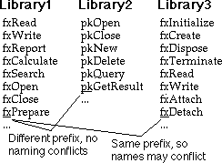

# 레슨 10. 프리뷰 - 다른 데이터 타입(A Preview of Other Data Type)

- [원문](https://dept-info.labri.fr/~strandh/Teaching/MTP/Common/David-Lamkins/chapter03-10.html)


## 리스프는 대부분의 숫자를 제대로 처리한다.

 뭔가 이상한 소리처럼 들립니다. 컴퓨터는 항상 숫자로 일을 처리하지 않나요?  음, 아닙니다... 보통은 그렇지 않습니다.

 수의 계산은 수 많은 방식으로 나뉠 수 있습니다. 가장 큰 문제가 되는 점 중 하나는 소수점(floating point) 계산이 있습니다 (혹여 여러분이 쓰고 있는 프로그래밍 언어가 이를 실수(real)라 부른다면, 아마 거짓말일 것입니다). 비쥬얼 어쩌고저쩌고 혹은 객체 지향 블라블라와 같은 많은 책들 중 대다수가 이 소수점 계산을 다루고 있습니다.

 소수점에서의 문제는 수학적으로 실수(real)가 아니지만, 종종 실수(real)인양 (잘못) 사용된다는 점입니다. 중대한 문제는 소수를 그렇게 사용한다면, 정확도에 한계가 생긴다는 점 입니다 - 소수점 우측 몇개의 자릿수 만큼. 이제, 계산에 사용되는 모든 숫자가 거의 같은 규모의 수라면, 계산의 정확도가 떨어지지 않을 수 있을 것입니다. 그러나, 규모가 매우 차이나는 숫자들이라면, 소수점 계산은 정확도가 희생될 것입니다.

 여러분의 컴퓨터의 소수가 정확하게 소숫점 7자리를 표현할수 있다고 가정해 봅시다. 그러면, 여러분은 `1897482.0`에 `2973225.0`를 더하면 완벽히 정확한 답을 얻을 수 있을 것입니다. 그러나, `1897482.0`에 `0.2973225`를 더하고자 한다면, 정확한 답은 `14`자리의 숫자이지만, 여러분의 컴퓨터는 `1897482.0`을 답으로 할 것입니다.

 소수에 관한 또 다른 문제는 더욱 미묘합니다. 프로그램을 작성할때 보통 10진수에 기반하여 수를 사용할 것입니다. 그러나 컴퓨터는 모든 연산을 2진수에 기반하여 수행합니다. 10진수에서 2진수로의 변환은 어떤 "명백히 정확한" 특정 숫자에 대해 재미난 일을 수행합니다. 예를들어, 소수 `0.1`은 2진수로 변환하면 순환 분수가 됩니다. 컴퓨터는 순환분수가 요구하는 무한한 숫자를 저장하지 못하기에, 0.1의 값을 정확히 저장할 수 없습니다.

 또, 정수(자연수) 연산에 관한 문제를 대부분의 컴퓨터 언어들이 가지고 있습니다 - 하나의 정수를 담을 수 있는 양수나 음수의 최대치에 제한이 있는 경향이 있습니다. 따라서, 숫자 하나를 여러분의 언어에 대해 컴퓨터를 다룰 수 있는 가장 큰 정수에 더하고자 한다면, 둘 중 하나가 일어납니다:

1. 에러가 발생해 프로그램이 종료된다.
2. 혹은, 굉장히 부정확한 답을 얻는다. (가장 큰 양수에 1을 더한게 가장 작은 음수를 만들어 낸다던가.)

 그렇다면 리스프는 숫자를 어떻게 올바르게 처리할까요? 우선, 이 문제가 컴퓨터의 연산에서 비롯된 것처럼 보입니다. 그렇다면 답은 컴퓨터 내장 산술 연산을 리스프는 직접 사용하지 않는 것입니다 - 수학적으로 정확한 특정 수치 데이터 형식을 추가하였습니다:

- `bignum`은 무한한 정수이다 (컴퓨터 메모리의 한계에 달려있습니다)
- 유리수는 두 정수의 정확한 몫이며, 나눗셈 알고리즘에서 나온 대략적인 소수가 아니다.

 물론, 리스프 또한 머신 기반 정수와 소수를 지닙니다. 머신에서의 정수를 리스프에서 `fixnum`라 부릅니다. `fixnum`의 범위에서 자연수를 넘겨받으면, 리스프는 이를 머신의 정수로 저장할 것입니다. 그러나, 이게 너무 커지면, 리스프는 자동으로 이를 `bignum`으로 승격시킬 것입니다.

 앞서 리스프는 대부분의 숫자를 제대로 처리한다고 말했는데, `거의 항상 수학적으로 옳은 수의 표현을 고른다` 라는 의미로 말했었습니다:

``` lisp
(/ 1 3)
;;=> 1/3

(+ (/ 7 11) (/ 13 31))
;;=> 360/341

(defun factorial (n)
  (cond ((= n 0) 1)
        (t (* n (factorial (- n 1))))))
;;=> FACTORIAL

(factorial 100)
;;=> 933262154439441526816992388562667004907159682643816214685
;;   929638952175999932299156089414639761565182862536979208272
;;   23758251185210916864000000000000000000000000
```

 소수점를 활용한 계산을 작성할 수 도 있지만, 리스프는 정확한 수치 결과를 자동으로 부정확한 소수로 전환할 수 없기에 일단 소수점을 활용하면, 전체 계산 결과가 소수점 유지하게 될 것입니다 (소수점 연산은 전염됩니다) :

``` lisp

(float (/ 1 3))
;;=> 0.3333333333333333

(* (float (/ 1 10)) 
   (float (/ 1 10)))
;;=> 0.010000000000000002

(+ 1/100 (* (float (/ 1 10))
            (float (/ 1 10))))
;;=> 0.020000000000000004

(+ 1/100 1/100) ; 이전 계산과 비교해 보시기 바랍니다
;;=> 1/50

(* 3 7 10.0)
;;=> 210.0

(- 1.0 1)
;;=> 0.0

(+ 1/3 2/3 0.0)
;;=> 1.0

(+ 1/3 2/3)
;;=> 1 ; 이전 계산과 비교해 보시기 바랍니다
```

 리스프는 소수를 소수점과 함께, 정수에는 소수점 없이 출력합니다.


## 문자는 리스프가 읽고 쓸 수 있는 무언가를 제공합니다.

 기본적으로 리스프 I/O(input/output)는 문자를 이용합니다. `READ`와 `WRITE` 함수는 문자를 리스프 오브젝트로 그리고 그 반대로 변환시킵니다. `READ-CHAR`와 `WRITE-CHAR`는 단일 문자를 읽고 씁니다.

``` lisp
(read)
;;<< a ⏎
;;=> A 

(read)
;;<< #\a ⏎
;;=> a

(read-char)
;;<< a
;;=> #\a

(write 'a)
;;>> A
;;=> A

(write #\a)
;;>> #\a
;;=> #\a

(write-char #\a)
;;>> a
;;=> #\a

(write-char 'a)
;;>| Error: Not a character
```

 위 예에서 새로운 표기를 추가했습니다. `;;<<` 표시는 `READ`와 같은 입력함수에 대한 입력을 기다린다는 것을 의미합니다. `⏎`은 엔터(enter)키에 의해 생성되는 개행문자를 나타냅니다.

 값을 반환하는 것(`;;=>`)과 달리 `;;>>`는 출력을 나타냅니다.

 개행 시 `read`의 입력받는 동작이 종료된다는 것을 알아채셨을 것입니다. `READ`는 문자들을 모아 완벽한 리스프 표현식을 구성하고자 하기 때문입니다. [레슨 11](./lesson_11.md)에서 이것에 대해 좀 더 살펴볼 것입니다. 이번 예제에서, `READ`는 개행으로 종료되는 심볼을 모읍니다. 이 심볼은 또한 공백, 괄호, 혹은 심볼이 될 수 없는 문자일때 종료됩니다.

 대조적으로, `READ-CHAR`는 입력에서 정확히 하나의 문자만 읽습니다. 문자를 받자마자 `READ-CHAR`는 실행을 완료하고 해당 문자를 반환합니다.

 몇몇 리스프 시스템은 어떠한 입력을 받아들이기 전에 리턴(return) 키를 누르도록 요구받을 것입니다. 이는 일반적인게 아니며, 환경 설정 변수로 변경 할 수 있을 것입니다 - 여러분이 사용하는 리스프의 제조사와 상담을 하시기 바랍니다.

 `WRITE`와 `WRITE-CHAR`는 둘 다 받은 값을 반환합니다. 값을 출력하는 방식은 다릅니다. `WRITE`는 값을 출력하므로, 동일한 값을 생성하는 `READ`로 표현할 수 있습니다. `WRITE-CHAR`는 단순히 읽을 수 있는 문자를 출력하며, 이는 `READ`에서의 문자라는 것을 나타내는 추가 리스프 문법 (`#\`)을 포함하지 않습니다.

 리스프는 단일 문자를 `#\char` 표기법을 이용하여 표시하는데, 이러한 `char`에 들어가는 것으로는 리터럴(literal) 문자이거나 상형문자로 출력 할 수 없는 문자의 이름이 있습니다.

| 문자            | 16진수 | Lisp        | 표준? |
| --------------- | ------ | ----------- | ----- |
| space           | 20     | #\Space     | yes   |
| newline         | --     | #\Newline   | yes   |
| backspace       | 08     | #\Backspace | semi  |
| tab             | 09     | #\Tab       | semi  |
| linefeed        | 0A     | #\Linefeed  | semi  |
| formfeed        | 0C     | #\Page      | semi  |
| carriage return | 0D     | #\Return    | semi  |
| rubout or DEL   | 7F     | #\Rubout    | semi  |

 `#\Space`와 `#\Newline`만이 모든 리스프 시스템에서의 요구사항 입니다. ASCII 문자셋를 이용하는 시스템은 아마 위에 나온 나머지 문자코드를 구현했을 것입니다.
 
`\#Newline` 문자는 호스트 시스템에 맞게 출력 라인의 끝을 표시하는 컨벤션(convention)을 따를것입니다. 예로:

| 시스템    | 개행  | 16진수 |
| --------- | ----- | ------ |
| Macintosh | CR    | 0D     |
| MS-DOS    | CR LF | 0D 0A  |
| Unix      | LF    | 0A     |

 94개의 출력 가능한 표준 문자들이 `\#char`로 표현됩니다:

``` txt
  ! " # $ % & ' ( ) * + , - . /
0 1 2 3 4 5 6 7 8 9 : ; < = > ?
@ A B C D E F G H I J K L M N O
P Q R S T U V W X Y Z [ \ ] ^ _
‘ a b c d e f g h i j k l m n o
p q r s t u v w x y z { | } ~
```

## 배열은 데이터를 테이블로 정리한다.

 여러분이 데이터를 2차원, 3차원 혹은 더 많은 차원의 테이블로 역으려고자 한다면, 배열(array)을 만들 수 있습니다:

``` lisp
(setq a1 (make-array '(3 4)))
;;=> #2A((NIL NIL NIL NIL)
;;       (NIL NIL NIL NIL)
;;       (NIL NIL NIL NIL))

(setf (aref a1 0 0) (list 'element 0 0))
;;=> (ELEMENT 0 0)

(setf (aref a1 1 0) (list 'element 1 0))
;;=> (ELEMENT 1 0)

(setf (aref a1 2 0) (list 'element 2 0))
;;=> (ELEMENT 2 0)

a1
;;=> #2A(((ELEMENT 0 0) NIL NIL NIL)
;;       ((ELEMENT 1 0) NIL NIL NIL)
;;       ((ELEMENT 2 0) NIL NIL NIL))

(aref a1 0 0)
;;=> (ELEMENT 0 0)

(setf (aref a1 0 1) pi)
;;=> 3.141592653589793

(setf (aref a1 0 2) "hello")
;;=> "hello"

(aref a1 0 2)
;;=> "hello"
```

 `MAKE-ARRAY`를 사용하여 배열의 차원에 나타내는 리스트를 넘겨 배열을 만들었습니다. 기본적으로, 배열은 어떠한 종류의 데이터라도 담을 수 있습니다; 성능을 위해 데이터 타입을 추가 인자로 넣어 제한 할 수도 있습니다.

 배열의 랭크(rank)는 차원(dimension)과 동일합니다. 위 예제에서 저희는 2차원 배열을 만들었습니다. 리스프는 `#rankA(...)`표기법을 이용하여 배열을 출력합니다. 배열의 내용물은, 첫번째 차원이 최상단 그룹의 요소로 보여지고, 마지막 차원이 최하단 그룹의 요소로 보여지는, 중첩된 리스트 표시됩니다.

 여러분의 리스프 시스템은 아마도 여기서 보여졌던것 처럼 라인을 넘기면서 배열을 출력하지 않을 수 도 있습니다. 여기서는 배열의 구조를 강조하기 위해 라인을 넘기면서 표시하였습니다.

 `AREF`를 이용하여 배열의 요소를 얻습니다. `AREF`의 첫번째 인수는 배열입니다; 나머지 인수로 각 차원의 인덱스(index)를 지정합니다. 인덱스는 배열의 랭크와 맞아야만 합니다.

 배열의 요소를 설정하기 위해선, 이 예제에서 보인것 처럼 `SETF` 폼 내부에서 `AREF`를 사용합니다. `SETF`는 `SETQ`와 유사하지만, `SETQ`는 심볼에게 값을 할당하고, `SETF`는 위치에 값을 할당합니다. 예제에서 `AREF` 폼은 배열의 요소로 위치를 지정했습니다.


## 백터는 일차원 배열

 백터(Vector)는 일차원 배열입니다. `MAKE-ARRAY`를 이용하여 벡터를 만들 수 있으며, `AREF`를 이용해 요소에 접근 할 수 있습니다.

``` lisp
(setq v1 (make-array '(3)))
;;=> #(NIL NIL NIL)

(make-array 3)
;;=> #(NIL NIL NIL)

(setf (aref v1 0) :zero)
;;=> :ZERO

(setf (aref v1 1) :one)
;;=> :ONE

(aref v1 0)
;;=> :ZERO

v1
;;=> #(:ZERO :ONE NIL)
```

리스프는 `#1A(...)`이 아닌 조금 간소화된 `#(...)` 폼을 이용하여 벡터를 출력합니다.

단일 원소 리스트나 벡터의 차원을 지정한 `MAKE-ARRAY` 중 선택할 수 있습니다.

`VECTOR` 폼에 값들을 나열하여 벡터를 만들 수 있습니다:

``` lisp
(vector 34 22 30)
;;=> #(34 22 30)
```

 결과값이 리스트가 아닌 벡터라는 점을 제외하면, 이는 `LIST` 폼과 유사합니다. 리스트와 벡터 사이에는 닮은게 하나 더 있습니다: 둘 다 시퀀스(sequence)입니다. 13장[p 150]에서 만나게 될 함수들로 시퀀스를 조작할 수 있습니다.

 벡터의 요소에 접근하기 위해 `AREF`를 사용하거나, 시퀀스에 특화된 함수 `ELT`를 사용할 수 있습니다:

``` lisp
(setf v2 (vector 34 22 30 99 66 77))
;;=> #(34 22 30 99 66 77)

(setf (elt v2 3) :radio)
;;=> :RADIO

v2
;;=> #(34 22 30 :RADIO 66 77)
```

## 문자열은 문자를 담고있는 백터

 여러분은 이미 `"..."`를 이용하여 문자열(string)을 작성하는 법을 알고 있습니다. 문자열은 벡터이기에, 문자열의 요소에 접근하기 위해 배열과 백터의 함수들을 적용할 수 있습니다. 또한 `make-string` 함수를 이용하여 문자열을 만들거나, `string` 함수를 이용하여 문자나 심볼을 문자열로 바꿀 수 있습니다.

``` lisp
(setq s1 "hello, there.")
;;=> "hello, there."

(setf (elt s1 0) #\H))
;;=> #\H

(setf (elt s1 12) #\!)
;;=> #\!

s1
;;=> "Hello, there!"

(string 'a-symbol)
;;=> "A-SYMBOL"

(string #\G)
;;=> "G"
```


## 심볼은 유니크하지만, 여러개의 값을 가진다.

 이미 [레슨 5](./lesson_05.md)에서 심볼은 고유한 동일성(identity)을 지닌다고 했는데, 반복해 설명할 필요가 있습니다: 심볼은 철자가 같은 다른 심볼과 동일합니다(이번 레슨 끝부분에서 좀 더 배우게 될 패키지 지정(designation)에 포함된). 이는 리스프로 하여금 프로그램이나 데이터를 읽을 수 있도록 만들어 주며, 철자가 같은 심볼은 모두 동일한 심볼입니다. 리스프가 이를 위한 매커니즘을 제공하기에, 심볼 정보를 다루는 프로그램을 작성하는 것에 대한 걱정을 하나 덜게 되었습니다.

 저희는 또한 [레슨 5](./lesson_05.md)에서 심볼은 변수와 함수, 그리고 문서, 출력 이름, 프로퍼티(properties)를 위한 값을 가질 수 있다고 배웠습니다. 심볼의 프로퍼티 리스트(property list)는 다수의 키/값 쌍이 심볼과 연결된 아주 작은 데이터베이스와 같습니다. 예를들어, 여러분의 프로그램이 오브젝트를 표현하고 다루고자 한다면, 오브젝트에 관한 정보를 프로퍼티 리스트에 저장할 수 있습니다:

``` lisp
(setf (get 'object-1 'color) 'red)
;;=> RED

(setf (get 'object-1 'size) 'large)
;;=> LARGE

(setf (get 'object-1 'shape) 'round)
;;=> ROUND

(setf (get 'object-1 'position) '(on table))
;;=> (ON TABLE)

(setf (get 'object-1 'weight) 15)
;;=> 15

(symbol-plist 'object-1)
;;=> (WEIGHT 15 POSITION (ON TABLE) SHAPE ROUND SIZE LARGE COLOR RED)

(get 'object-1 'color)
;;=> RED

object-1
;;>| Error: no value
```

 `OBJECT-1`은 값을 갖지 않는다는 점을 주목하시기 바랍니다 - 중요한 것은 바로 이 두 부분입니다: 심볼의 동일성과 심볼의 프로퍼티.

 이러한 프로퍼티의 이용은 현대의 객체 지향 프로그래밍보다 몇 십년이나 앞서 나왔습니다. 이는 오브젝트의 필수적인 3가지 매커니즘 중 2가지를 제공합니다: 동일성(identify)과 캡슐화(encapsulation) (프로퍼퍼티의 값 역시 함수가 될 수 있다는 점을 명심하시기 바랍니다). 3번째 매커니즘 상속(inheritance)은 다른 "오브젝트"를 연결하여 시뮬레이션합니다.

오늘날의 리스프 프로그램에서는 프로퍼티는 거의 사용되지 않습니다. 해쉬테이블(Hashtables) (아래 참조) [p 73] , (다음 단락에서 기술된) 구조체(structures), CLOS 오브젝트(7장 [p 117]과 14장 [p 157] 참조)는 사용하기 더 편리하며 더욱 효율적인 방식으로 프로퍼티 리스트의 모든 기능을 제공합니다. 현대 리스프의 개발에선 프로퍼티 파일과 심볼을 정의하는 폼의 파일 위치, 함수의 인자 리스트의 정의와 같은 (프로그래밍 환경에서 유용한 도구로 이용하기 위한) 특정 정보를 프로그램에 주석으로써 기록하는 목적으로 주로 사용합니다.


## 구조체는 연관된 데이터들을 모아 저장할 수 있다.

 리스프 구조체는 명명된 슬롯(slot)과 관계된 데이터를 저장하는 오브젝트를 생성하는 방법을 제공해 줍니다.

``` lisp
(defstruct struct-1
  color
  size
  shape
  position
  weight)
;;=> STRUCT-1

(setq object-2 (make-struct-1
                              :size 'small
                              :color 'green
                              :weight 10
                              :shape 'square))
;;=> #S(STRUCT-1 :COLOR    GREEN
;;               :SIZE     SMALL 
;;               :SHAPE    SQUARE
;;               :POSITION NIL
;;               :WEIGHT   10)

(struct-1-shape object-2)
;;=> SQUARE

(struct-1-position object-2)
;;=> NIL

(setf (struct-1-position object-2) '(under table))
;;=> (UNDER TABLE)

(struct-1-position object-2)
;;=> (UNDER-TABLE)
```

 이 예에서, 우리는 `COLOR`, `SHAPE`, `SIZE`, `WEIGHT` 슬롯을 지닌 `STRUCT-1` 구조체를 정의하였습니다. 그런 다음 `STRUCT-1`의 인스턴스(instance)를 만들고, 해당 인스턴스를 변수 `OBJECT-2`에 할당하였습니다. 예제의 나머지 부분은, 구조체의 타입과 슬롯 이름으로 구성된 접근자(assessor)함수를 이용하여, 어떻게 구조체 인스턴스의 슬롯에 접근할 수 있는지 보여주고 있습니다. `DEFSTRUCT`를 이용하여 구조체를 정의하면 리스프는 `make-구조체명`과 `구조체명-슬롯명` 함수도 만들어 줍니다.

 6장[p 112]에서 `DEFSTRUCT`의 optional 기능에 대해 살펴볼 것입니다.


## 타입 정보를 런타임에 알 수 있다.

 심볼은 런타임시 어떠한 변수 타입과도 연관지을 수 있습니다. 문제가 있는 경우, 리스프는 해당 값의 타입을 질의할 수 있는 방법을 제공합니다:

``` lisp
(type-of 123)
;;=> FIXNUM

(type-of 123456789000)
;;=> BIGNUM

(type-of "hello, world")
;;=> (SIMPLE-BASE-STRING 12)

(type-of 'fubar)
;;=> SYMBOL

(type-of '(a b c))
;;=> CONS
```

 `TYPE-OF` 는 인수의 타입을 나타내는 심볼 혹은 리스트를 반환합니다. 게다가 이 정보를 이용하여 인자의 타입에 기반한 프로그램의 동작 방식을 조정 할 수 있습니다. `TYPECASE` 함수는 타입에 대한 질의(inquiry)와 COND-와 같은 분기(dispatch)를 결합한 것입니다.

 CLOS(14장 [p 157] 참조)의 제네릭 함수의 도입으로, `TYPE-OF`는 예전만큼 중요하지는 않습니다.


## 해쉬 테이블은 룩업키로 빠르게 데이터에 접근 할 수 있다.

 해쉬 테이블은 유니크 키(유일 키, unique key)와 값의 연결로 이루어져 있습니다. 프로퍼티 리스트완 다르게, 해쉬 테이블은 수 많은 키/값 쌍에 적합하며, 적은 수의 연결 집합에 대해서는 과도한 오버헤드(overhead)가 발생합니다.

``` lisp
(setq ht1 (make-hash-table))
;;=> #<HASH-TABLE>

(gethash 'quux ht1)
;;=> NIL
;;=> NIL

(setf (gethash 'baz ht1) 'baz-value)
;;=> BAZ-VALUE

(gethash 'baz ht1)
;;=> BAZ-VALUE
;;=> T

(setf (gethash 'gronk ht1) nil)
;;=> NIL

(gethash 'gronk ht1)
;;=> NIL
;;=> T
```

 `MAKE-HASH-TABLE`을 이용하여 해쉬 테이블을 만들었으며, `GETHASH`를 이용하여 값에 접근하였습니다. `GETHASH`는 두개의 값을 반환합니다. 첫번째는 해당 키와 연결된 값입니다. 두번째는 키를 찾으면 `T`, 아니면 `NIL`입니다. 위 예제에서 `GETHASH`폼의 처음과 마지막 차이를 주목하시기 바랍니다.

 해쉬테이블은 기본적으로 `EQ`(이는 숫자나 리스트가 아닌 심볼에 대해서만 동작합니다)를 이용하여 키를 비교하도록 만들어졌습니다. 17장[p 174]에서 동등성 판단(equality predicates)에 대해 더 자세히 배울 것입니다. 지금은 키에 숫자를 사용하려면 다음과 같은 형식을 사용하여 해시 테이블을 만들어야 한다는 점만 명심하시기 바랍니다:

``` lisp
(make-hash-table :test #'eql)
```

 리스트를 키로 사용하고자 한다면, 이렇게 해쉬테이블을 만듭니다:

``` lisp
(make-hash-table :test #'equal)
```

 키를 없애고자 한다면 `(REMHASH key hash-table)`폼을 이용합니다. 그리고 키에 해당하는 값을 바꾸고자한다면, 키/값 쌍을 추가했던 것처럼 `GETHASH`와 `SETF`를 이용합니다.


## 패키지로 이름 충돌을 방지할 수 있다.

 프로그램을 작성시 어려운 점 중 하나는 이름 짓는 것입니다. 한편으론, 기억하기 쉽고 해당 객체의 역할이나 목적을 떠올릴 수 있는 이름을 사용하기 원할 것입니다. 그리고 다른 한편으론, 다른 프로그램의 어딘가에 이미 사용한 (혹은 사용될 것 같은)이름을 여러분의 프로그램에서 사용하고 싶진 않을 것입니다.

 이름 충돌(naming conflict)을 피하는 법 중 하나는 프로그램에 있는 모든 이름에 누구도 사용하지 않는 고유 접두사(prefix)를 붙이는 것입니다. 라이브러리에서 이러한 방식을 자주 볼 수 있습니다 - 보통 1~3자로 접두사를 붙입니다. 불행히도, 여전히 두 소프트웨어 개발자가 동일한 접두사를 선택할 수 있는 관문이 남아있습니다; 일부 접두사가 다른 접두사들보다 더 매력적인 경우. 모든 소프트웨어를 제어할 수 있다면, 모든 접두사를 선택하여 문제를 피할 수 있습니다. 타사 소프트웨어를 구입하는 경우, 제조사에 의해 선택된 이름을 사용해야만 하며, 동일한 접두사를 사용하지 않기를 바래야만 할 것입니다.

 

 이름 충돌을 피하는 또 하나의 방법은 한정된 이름(qualified name)을 사용하는 것입니다. 이를 위해, 언어는 프로그래머에 의해 정의되고 제어되는 분리된 이름공간을 제공해야 합니다. 어떻게 이것이 동작하는지 이해하기 위해, 프로그램에 쓰이는 모든 이름이 한장에 종이 상단의 타이틀 부분에 작성되었다고 상상해보시기 바랍니다. 이름을 사용해도 안전한지 확인하려면, 이 페이지에 작성한 이름 목록을 확인하기만 하면 됩니다. 누군가의 소프트웨어가 여러분의 프로그램의 서비스를 필요로 할 때, 그 누군가는 여러분들이 한정한 이름을 참조할 것입니다. 다른이의 소프트웨어는 그들만의 규칙이 이름을 한정할 것이며 있을 것이며, 이름 충돌이 발생할 가능성이 없습니다.

한정자는 이름에 접두사를 추가하는 복잡한 방법에 지나지 않는다고 생각할 수 있습니다. 그러나, 거기엔 미묘하며 중대한 차이점이 있습니다. 접두사는 이름의 일부이므로 한 번 쓰면 변경할 수 없습니다. 한정자는 한정하는 이름과 분리되어 있으며 정확히 한 곳에 "기록"되었습니다. 더욱이, 이름이 적혀 있는 "종이"를 가리키며 "이러한 이름들"이라고 지칭할 수 있습니다. 다른 프로그래머와 동일한 한정자를 선택한 경우에도, 자신이 선택한 한정자로 "그 이름들"을 지칭할 수 있습니다 - 다른 말로 하자면, 여러분이 사용할 소프트웨어가 출고된 후에도, 한정자를 변경할 수 있습니다.


 위 예로 두 라이브러리 `LIB1`와 `LIB2`가 있습니다. 두 라이브러리를 설계한 사람은 리스프에서 패키지 이름으로 알려진 이름 공간(namespace)을 `UTIL`이라 이름 붙였습니다. 각 라이브러리는 클라이언트에 노출될 이름들이 나열되어 있습니다. 두 라이브러리를 이용하는 프로그래머는 `MY-PACKAGE`란 패키지 이름에서 코드를 작성했습니다. 각 라이브러리를 로드한 후, 이름들을 구분할 수 있도록 프로그래머는 이의 패키지 이름을 바꾸었습니다. 그러면, `UTIL-1:INITIALIZE`와 `UTIL-2:INITIALIZE`의 호출에서 봤던 것처럼, 라이브러리에 있는 이름들은 이름이 바뀐 한정자를 활용하여 참조됩니다. 프로그래머는 한정자가 없는 `INITIALIZE`란 이름을 여전히 사용 할 수 있다는 점을 주목하시기 바랍니다 - 이는 `MY-PACKAGE:INITIALIZE`와 동일합니다.

``` lisp
;;;; file: util1.lisp
(defpackage util1
  (:export init func1 func2)
  (:use common-lisp))
(in-package util1)

(defun init () 'util1-init)
(defun func1 () 'util1-func1)
(defun func2 () 'util1-func2)
``` 

``` lisp
;;;; file: util2.lisp
(defpackage util2
  (:export init func1 func2)
  (:use common-lisp))
(in-package util2)

(defun init () 'util2-init)
(defun func1 () 'util2-func1)
(defun func2 () 'util2-func2)
``` 

``` lisp
;;;; file: client.lisp
(defpackage client
  (:use common-lisp)
  (:import-from util1 func1)
  (:import-from util2 func2))
(in-package client)

(defun init () 'client-init)

(util1:init)
(util2:init)
(init)
(func1)
(func2)
```

 예제는 세개의 파일의 내용물을 나열했습니다. `util1.lisp`와 `util2.lisp`는 모두 동일한 이름으로 3개의 함수를 정의하였습니다. `util1.lisp`는 이름들을 `UTIL1`패키지에 넣었으며, `util2.lisp`는 `UTIL2`패키지를 이용합니다. `defpackage` 폼은 패키지의 이름을 정의합니다. `:use` 옵션은 한정자 없이 이름을 가져올 패키지명을 지정하며, `:EXPORT` 옵션은 패키지에서 다른 클라이언트들에게 노출될 이름들을 지정합니다.

 `defpackage` 폼은 단지 패키지를 생성합니다. `use-package` 폼은 패키지를 현재 사용 중인 패키지로 만듭니다 -  한정하지 않은 모든 이름들은 현재 패키지에 포함됩니다. `COMMON-LISP:*PACKAGE*` 변수는 항상 현재 이용중인 패키지를 포함합니다.

 `client.lisp`은 `CLIENT` 패키지를 만듭니다. `:INFORT-FROM` 옵션은 `UTIL1`과 `UTIL2`패키지로부터 특정 이름들을 가져옵니다 - 여기서 가져온 이름들은 `CLIENT`패키지에서 한정자 없이 사용할 수 있습니다. `UTIL1`나 `UTIL2`에서 익스포트(export)하고, `CLIENT`에서 임포트(import)가 되지 않은 이름들은, `pakcage:name` 폼과 같이 명시적 한정자(explicit qualifier)를 이용하여 `CLIENT`에서 참조하여 사용할 수 있습니다.

 이번 단락에선 아주 기초적인 패키지 연산만을 다루었습니다. 31장[p 247]에서, 더 큰 규모의 소프트웨어 시스템을 구축하면서 패키지의 좀 더 자세한 내용을 다룰 것입니다.


## 짚고 넘어가기

- `read`
- `write`
- `read-char`
- `write-char`
- `make-array`
- `aref`
- `vector`
- `elt`
- `string`
- `type-of`
- `make-hash-table`
- `gethash`
- `remhash`
- `defstruct`
- `defpackage`
- `in-package`